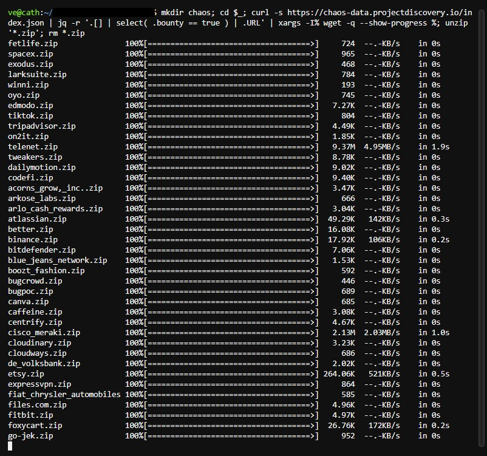

# Bounty Target

## crafted by @vsec7

## One Liner to fetch target list from https://chaos-data.projectdiscovery.io


```
mkdir chaos; cd $_; curl -s https://chaos-data.projectdiscovery.io/index.json | jq -r '.[] | select( .bounty == true ) | .URL' | xargs -I% wget -q --show-progress %; unzip '*.zip'; rm *.zip
```

## One Liner to fetch target list from github.com/projectdiscovery/public-bugbounty-programs/

```
curl -s https://raw.githubusercontent.com/projectdiscovery/public-bugbounty-programs/master/chaos-bugbounty-list.json | jq -r '.programs[] | select( .bounty == true ) | .domains[]'
```
